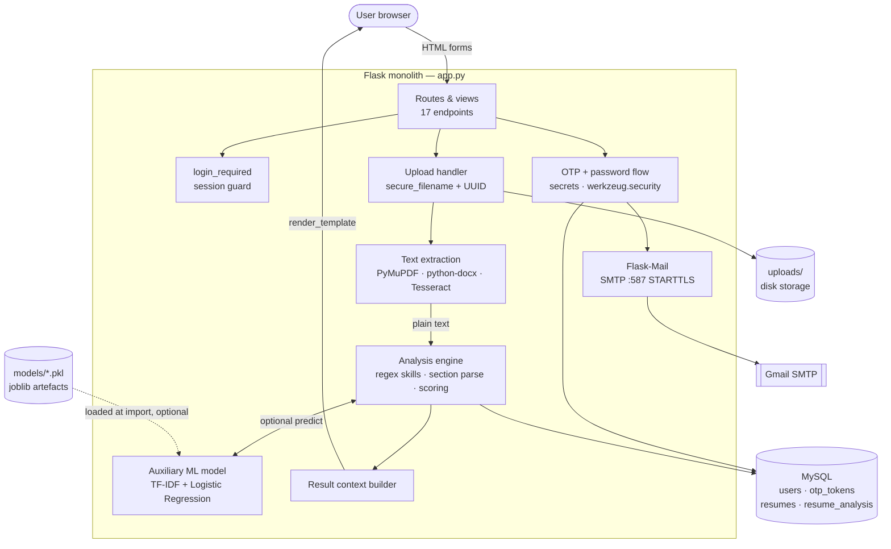
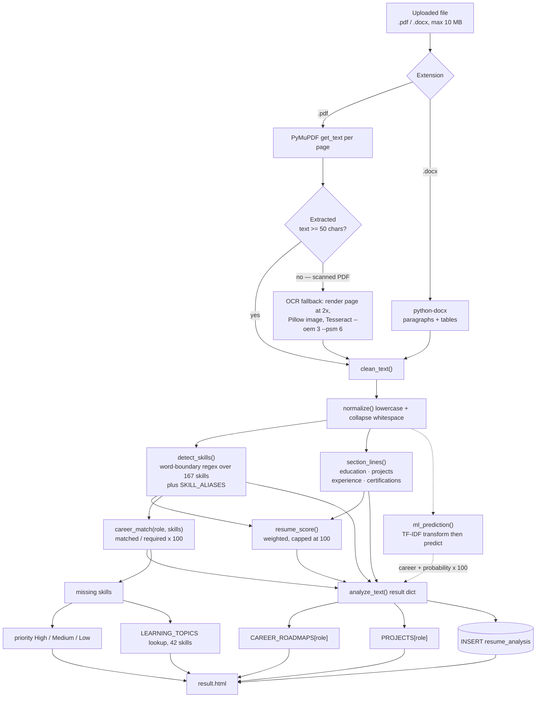
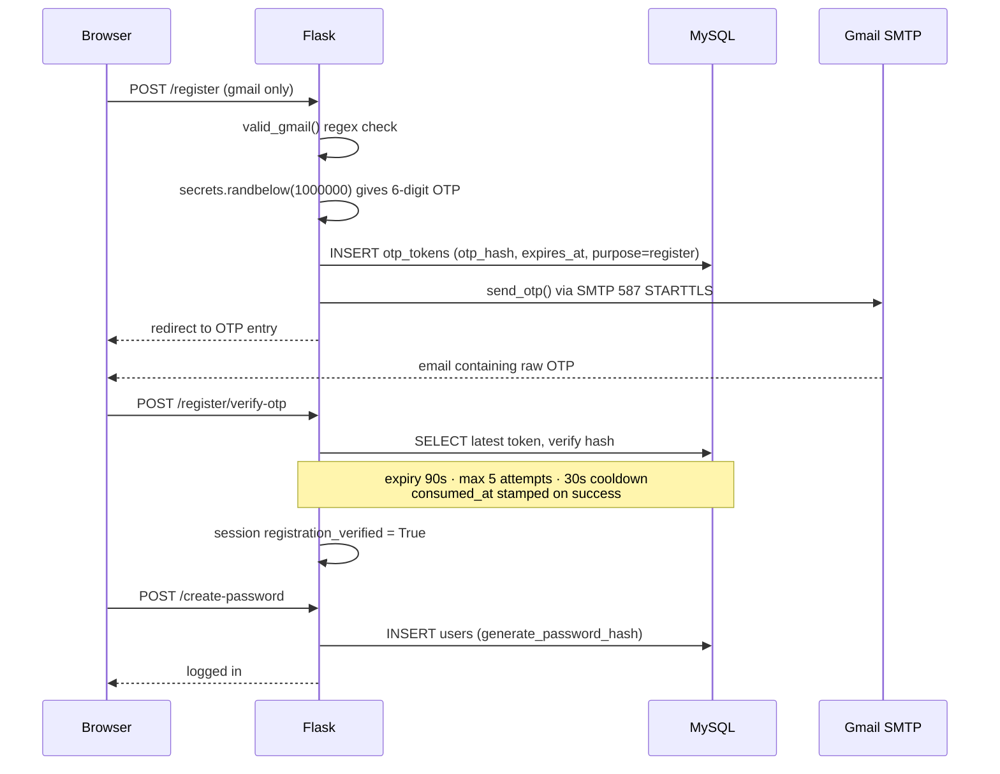
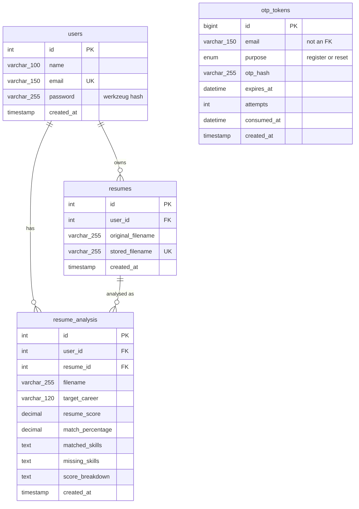

# Architecture

Technical reference for AI Resume Analyzer. Everything here is read directly
from `app.py`, `database.sql`, and `templates/` — no aspirational components.

> **Structural honesty note:** this is a **monolith**. `app.py` is a single
> ~5,000-line Flask module holding configuration, data catalogues, the analysis
> engine, OTP/email logic, database access, and 17 routes. There is no
> blueprint split, service layer, ORM, cache, queue, or API gateway. Diagrams
> below show logical responsibilities, not separate deployable services.

---

## System overview

*Solid = always on this path · dashed = optional, degrades gracefully.*

---

## What runs at process start

Before the first request, importing `app.py`:

1. `load_dotenv()` reads `.env` if present — **absence is fine**, every lookup
   has a default.
2. Flask app created; `SECRET_KEY`, `MAX_CONTENT_LENGTH` (10 MB), and OTP
   timings set from environment.
3. `Mail(app)` initialised.
4. Static catalogues built in memory: `CAREERS` (40), `SKILLS` (167),
   `SKILL_ALIASES` (10), `LEARNING_TOPICS` (42), `CAREER_ROADMAPS` (40),
   `PROJECTS` (40).
5. `joblib.load()` attempts the two model artefacts inside `try/except`. If
   they are missing or corrupt, it logs a warning and continues with
   `model = None` — the app still serves full rule-based analysis.
6. `uploads/` is created if absent.

**Verified:** the module imports cleanly with no `.env`, no MySQL, and no SMTP
server. This is what CI relies on — see
[`.github/workflows/ci.yml`](../.github/workflows/ci.yml).

---

## Request flow

| Method | Route | Auth | Responsibility |
| ------ | ----- | ---- | -------------- |
| GET | `/` | — | Upload form + searchable career selector |
| GET/POST | `/login` | — | Email + password, seeds session |
| GET/POST | `/register` | — | Gmail validation, issues OTP |
| POST | `/register/verify-otp` | — | Consumes registration OTP |
| POST | `/resend-otp` | — | Throttled OTP reissue |
| GET/POST | `/create-password` | — | Sets password post-verification |
| GET/POST | `/forgot-password` | — | Issues reset OTP |
| GET | `/verify-otp/<purpose>` | — | OTP entry screen |
| POST | `/verify-reset-otp` | — | Consumes reset OTP |
| GET/POST | `/reset-password` | — | Sets new password |
| POST | `/analyze` | ✅ | Upload + analyse a new resume |
| POST | `/analyze-existing` | ✅ | Re-score a stored resume against another career |
| GET | `/history` | ✅ | List saved analyses |
| POST | `/clear-history` | ✅ | Delete the current user's analyses |
| GET | `/history/<int:analysis_id>` | ✅ | Single analysis detail |
| GET/POST | `/profile` | ✅ | Account details |
| GET | `/logout` | — | Clears session |

Plus `413`, `404`, and `500` error handlers rendering `error.html`.

---

## Analysis pipeline

This is the core of the product. Note where the model is **optional**.

### Deterministic vs learned

| Capability | Mechanism | Deterministic? |
| ---------- | --------- | -------------- |
| Text extraction | PyMuPDF / python-docx / Tesseract | ✅ Yes |
| Skill detection | Word-boundary regex + alias map | ✅ Yes |
| Section parsing | Heading-alias line matching | ✅ Yes |
| Resume score | Fixed weighted formula | ✅ Yes |
| Career match % | Set intersection ratio | ✅ Yes |
| Skill priority, topics, roadmap, projects | Catalogue dict lookups | ✅ Yes |
| **Career suggestion + confidence** | **TF-IDF + Logistic Regression** | ❌ Learned (auxiliary) |

Most of the product is **deterministic and explainable**; the learned model
contributes one advisory field. See [ml-pipeline.md](ml-pipeline.md).

---

## Authentication and OTP flow

The same machinery serves password reset under `purpose='reset'`. The raw OTP
is never persisted — only its hash.

---

## Data model

Four tables, defined in [`database.sql`](../database.sql). Column-level
reference in [database-schema.md](database-schema.md).

`otp_tokens.email` is deliberately **not** a foreign key: reset OTPs must work
while a password is changing, and registration OTPs exist before the `users`
row does.

---

## Technology responsibilities

| Component | Role |
| --------- | ---- |
| **Flask** | Routing, sessions, templating, upload handling, error pages |
| **Flask-Mail** | SMTP delivery of OTP emails |
| **mysql-connector-python** | Direct DB-API access — no ORM |
| **PyMuPDF** | PDF text extraction; rasterises pages for OCR |
| **Pillow** | In-memory bridge between PyMuPDF pixmaps and Tesseract |
| **Tesseract OCR** | Text recovery for image-only PDFs |
| **python-docx** | DOCX paragraph and table extraction |
| **scikit-learn** | `TfidfVectorizer` + `LogisticRegression` for the advisory model |
| **joblib** | Serialising and loading model artefacts |
| **python-dotenv** | Loading `.env` into the environment |
| **Werkzeug** | Password hashing, filename sanitisation |
| **Jinja2** | Server-rendered templates — no frontend framework |

**Deliberately absent:** JavaScript build tooling, an ORM, a REST/JSON API, a
task queue, Redis, Docker, and a model-serving service. Adding these is a
design decision, not an oversight.

---

## Extension points

Where new work belongs, in rough order of ease:

| Change | Location |
| ------ | -------- |
| New career + required skills | `CAREERS` |
| New roadmap stages | `CAREER_ROADMAPS` |
| New recommended projects | `PROJECTS` |
| New learning topics | `LEARNING_TOPICS` |
| Better skill recall | `SKILL_ALIASES` |
| Score weighting | `resume_score()` |
| Section-heading variants | `section_lines()` alias map |
| Retrained model | `ml_training/train_model.py` |
| Schema change | `database.sql` (add `ALTER` notes) |

---

## Scaling and structural limits

Being candid about these is more impressive than hiding them:

- **Single module.** 5,000 lines in one file makes ownership and testing hard.
  Splitting into Flask blueprints is the natural first refactor.
- **Synchronous OCR.** A dense scanned PDF occupies a request worker for the
  whole OCR pass; a task queue would be needed under real load.
- **Disk-bound uploads.** `uploads/` does not scale horizontally without
  shared object storage.
- **No connection pooling.** A fresh MySQL connection is opened per call.
- **No analysis cache.** Re-running the same resume and career recomputes.
- **Session auth only.** No tokens, so no programmatic API consumers.

None of these are bugs at portfolio scale — they are the boundaries of the
current design.

---

## Related documents

- [ml-pipeline.md](ml-pipeline.md) — the model in detail, including its limits
- [database-schema.md](database-schema.md) — column reference and constraints
- [SECURITY.md](../SECURITY.md) — implemented protections
- [demo/README.md](demo/README.md) — the canonical end-to-end recording flow
