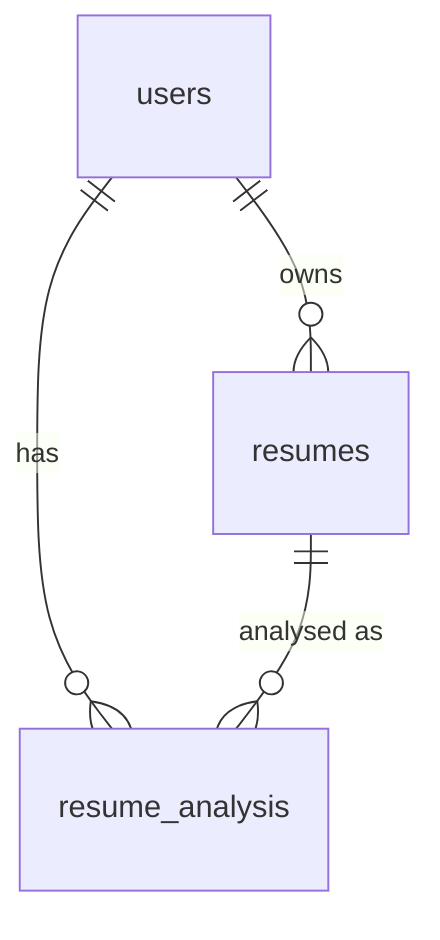

# Database schema

Column-level reference for the PostgreSQL tables that hold **all** application
data in Supabase. Schema shape, constraints, the queries that depend on them,
and what happens to rows over time.

> **Read with:** [architecture.md](architecture.md) for the request flow and the
> ER diagram, and [`database.sql`](../database.sql) for the original reference
> DDL. This page is the PostgreSQL view of the same four tables.

---

## How the application connects

| Item | Value |
| ---- | ----- |
| Driver | `psycopg` (v3) — direct DB-API access, no ORM, no SQL builder |
| Server | Supabase PostgreSQL (`public` schema) |
| Connection string | `SUPABASE_DB_URL`, or derived from `SUPABASE_URL` + `SUPABASE_DB_PASSWORD` (optional `SUPABASE_DB_HOST` / `_PORT` / `_USER` / `_NAME`) |
| TLS | Always — `sslmode=require` is enforced by the app |
| Timeouts / pooling | `connect_timeout=10`; `prepare_threshold=None` so the Supabase pooler is safe; **a fresh connection is opened per database operation** and closed in a `finally` block |
| Credentials | `.env` / environment only — never in templates, JavaScript, logs or the repository |

**Why the publishable key is not used here.** Supabase's publishable (anon) key
is an HTTP API key. Row-level security on these tables rejects its writes
(`42501 new row violates row-level security policy`), so it cannot execute the
application's SQL. The Flask backend authenticates with the database role
instead and never ships a key to the browser. RLS can stay fully enabled.

---

## Entity relationships

`otp_tokens.email` is intentionally **not** a foreign key: registration OTPs
exist before the `users` row does, and reset OTPs must work while a password is
being changed.

---

## `users`

| Column | Type | Null / Default | What the app does with it |
| ------ | ---- | -------------- | ------------------------- |
| `id` | integer *(verified)* | primary key | Stored as `session["user_id"]`; scopes every resume, analysis and profile query |
| `name` | varchar(100) | NOT NULL | Session label; read at login, updated by the profile form |
| `email` | varchar(150) | NOT NULL, **UNIQUE** | Registration duplicate check, login lookup, forgot-password lookup, reset target |
| `password` | varchar(255) | NOT NULL | Werkzeug hash written at *create password* / *reset*; verified at login. Plaintext is never stored |
| `created_at` | timestamp *(verified)* | `CURRENT_TIMESTAMP` | Not read by the app |

---

## `otp_tokens`

One row per issued OTP. The raw 6-digit code exists only inside the email.

| Column | Type | Null / Default | What the app does with it |
| ------ | ---- | -------------- | ------------------------- |
| `id` | bigint *(verified)* | primary key | Returned by `INSERT … RETURNING id`; used to delete the row when the email fails to send |
| `email` | varchar(150) | NOT NULL | Partitions tokens per address; deliberately not a foreign key |
| `purpose` | text — only `'register'` or `'reset'` is ever written *(the original MySQL DDL used `ENUM('register','reset')`)* | NOT NULL | Keeps the registration and reset lanes apart |
| `otp_hash` | varchar(255) | NOT NULL | Werkzeug hash of the OTP; compared with `check_password_hash` |
| `expires_at` | timestamp | NOT NULL | Compared against `datetime.utcnow()` — a 90-second lifetime |
| `attempts` | integer *(verified)* | NOT NULL, default `0` | Incremented on a wrong code; the row is refused at 5 attempts |
| `consumed_at` | timestamp *(verified)* | NULL | Stamped with `NOW() AT TIME ZONE 'UTC'` on success, and when a newer OTP supersedes an older one |
| `created_at` | timestamp | `CURRENT_TIMESTAMP` | The newest row drives the 30-second resend cooldown |

**Lookup that must stay fast:**
`WHERE email = ? AND purpose = ? AND consumed_at IS NULL ORDER BY id DESC LIMIT 1`
— the latest unconsumed token for one lane.

---

## `resumes`

Metadata for each uploaded file. The file itself stays on disk in `uploads/` —
only the record lives in PostgreSQL.

| Column | Type | Null / Default | What the app does with it |
| ------ | ---- | -------------- | ------------------------- |
| `id` | integer *(verified)* | primary key | Foreign key target for `resume_analysis.resume_id`; sent back by the "re-analyse this resume" form |
| `user_id` | integer | NOT NULL, FK → `users.id` `ON DELETE CASCADE` | Ownership filter on every read and delete |
| `original_filename` | varchar(255) | NOT NULL | Display name on the result and history pages |
| `stored_filename` | varchar(255) | NOT NULL, **UNIQUE** | Random UUID + extension; resolves the file inside `uploads/` |
| `created_at` | timestamp | `CURRENT_TIMESTAMP` | Drives the home page "Recent resumes" list (`ORDER BY created_at DESC`) |

---

## `resume_analysis`

One row per completed analysis — the history the user sees.

| Column | Type | Null / Default | What the app does with it |
| ------ | ---- | -------------- | ------------------------- |
| `id` | integer *(verified)* | primary key | Addresses `/history/<int:analysis_id>` |
| `user_id` | integer | NOT NULL, FK → `users.id` `ON DELETE CASCADE` | Filters history to the signed-in user |
| `resume_id` | integer | NOT NULL, FK → `resumes.id` `ON DELETE CASCADE` | Groups runs of the same file (the "recommended" best-match flag) and joins for the detail view |
| `filename` | varchar(255) | NOT NULL | Snapshot of the display name at analysis time |
| `target_career` | varchar(120) | NOT NULL | Re-runs the same career when a history entry is reopened |
| `resume_score` | numeric *(verified; `DECIMAL(5,2)` in the reference DDL)* | NOT NULL, default `0` | Score column in history |
| `match_percentage` | numeric *(verified; `DECIMAL(5,2)` in the reference DDL)* | NOT NULL, default `0` | Match column in history, and the value compared to pick the recommended run |
| `matched_skills` | text | NULL | Written for the record (comma-joined) — the detail view re-analyses the stored file rather than rendering these columns |
| `missing_skills` | text | NULL | As above |
| `score_breakdown` | text | NULL | As above (the per-section breakdown dict, stringified) |
| `created_at` | timestamp | `CURRENT_TIMESTAMP` | History ordering (`ORDER BY created_at DESC`) |

---

## Constraints and indexes

| Object | Definition | Why it matters |
| ------ | ---------- | -------------- |
| `users.email` UNIQUE | unique index | The duplicate-registration path **relies** on the database raising a unique violation — the app catches it and redirects to login instead of creating a second account |
| `resumes.stored_filename` UNIQUE | unique index | A UUID collision would overwrite a stored file instead of failing loudly |
| FK `resumes.user_id → users.id` | `ON DELETE CASCADE` | Deleting a user removes their records |
| FK `resume_analysis.user_id → users.id`, `resume_analysis.resume_id → resumes.id` | `ON DELETE CASCADE` | History cannot outlive the file it describes |
| `idx_otp_lookup` | `(email, purpose, created_at)` | Serves the latest-OTP lookup and the resend cooldown query |
| `idx_resumes_user` | `(user_id)` | Home page, resume listing, ownership checks |
| `idx_analysis_user_date` | `(user_id, created_at)` | History page ordered by date |
| `idx_analysis_resume` | `(resume_id)` | Grouping runs per file, and the detail-view join |

---

## Query patterns the schema must keep supporting

| Pattern | Where | Note |
| ------- | ----- | ---- |
| Parameterised `%s` placeholders | Everywhere | No string-built SQL, ever |
| `INSERT … RETURNING id` | `otp_tokens`, `resumes`, `resume_analysis` | The successor to MySQL's `lastrowid`; the app reads the returned row |
| `NOW() AT TIME ZONE 'UTC'` | `otp_tokens.consumed_at` | Timestamps are UTC, matching the app's `datetime.utcnow()` comparisons |
| Dictionary cursors (`row_factory=dict_row`) | OTP verification, history, listing queries | Rows are read by column name |
| `ORDER BY … DESC LIMIT 1` | Latest OTP | Needs an `(email, purpose, created_at)`-style index to stay cheap |
| One `JOIN` | History detail: `resume_analysis ⋈ resumes` on `(id, user_id)` | Keeps the stored filename reachable for re-analysis |
| `DELETE` ordering | Clear history | Analysis rows first, then resume rows, then unlink the files in `uploads/` |

---

## Row lifecycle

- **OTP rows** are superseded (stamped `consumed_at`) rather than deleted, so the
  audit trail survives; the only hard delete is the cleanup of a token whose
  email could not be sent.
- **Analysis rows** are deleted by "clear history", scoped to the signed-in
  user: `resume_analysis` first, then `resumes`, then the files on disk.
- **Resume files** are never stored in PostgreSQL. `uploads/` is gitignored and
  CI fails if a resume file is committed.
- **Secrets are never stored**: `users.password` and `otp_tokens.otp_hash` hold
  Werkzeug hashes only.

---

## Changing the schema safely

1. Prefer additive changes (`ADD COLUMN … NULL`) — the app inserts explicit
   column lists, so a new nullable column does not break it.
2. Update the matching `SELECT` list in `app.py` in the same change: every read
   names its columns explicitly, except `SELECT * FROM otp_tokens`.
3. Keep `RETURNING id` working — the OTP, resume and analysis inserts depend on
   it.
4. Mirror the change in [`database.sql`](../database.sql) (or add an `ALTER`
   note) so the reference DDL and the live database do not drift.
5. Nothing here should ever require dropping a column or disabling RLS.

### Verified against the live project

Every column listed on this page was confirmed to exist in the Supabase
database, and the `id`, `attempts`, `resume_score`, `match_percentage`,
`created_at` and `consumed_at` types were confirmed with read-only type probes
(`integer`, `bigint`, `numeric`, `timestamp`). Unique keys, foreign keys and
indexes cannot be introspected through Supabase's HTTP API; the definitions
above are the reference DDL the project was created from and the behaviour the
application relies on. The tables were empty at verification time.

---

## Related documents

- [architecture.md](architecture.md) — request flow, ER diagram, scaling limits
- [ml-pipeline.md](ml-pipeline.md) — the advisory model behind the scores
- [../SECURITY.md](../SECURITY.md) — hashing, OTP and credential handling
- [../database.sql](../database.sql) — original reference DDL
