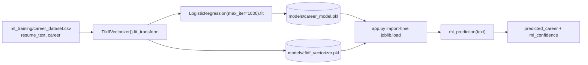

# ML pipeline

The advisory career model — what it is, how it is trained, how `app.py` uses it
at runtime, and where it stops being trustworthy.

> **Honesty note:** the shipped artefacts are trained on a **9-row synthetic
> dataset** covering **3 careers**. They demonstrate the pipeline; they are not
> a production classifier. Everything critical in the product — resume score,
> match %, priority, roadmap, learning topics, project suggestions — is
> **deterministic and independent of this model**. The deterministic/learned
> split is tabulated in [architecture.md](architecture.md).

---

## Where the model sits

| Layer | Output | Needs the model? |
| ----- | ------ | ---------------- |
| Text extraction (PyMuPDF / python-docx / Tesseract) | raw resume text | ❌ no |
| Skill detection, section parsing | skills, education, projects, experience, certifications | ❌ no |
| Resume score | 0–100 from a fixed weighted formula | ❌ no |
| Career match % | set intersection with `CAREERS[role]` | ❌ no |
| Priority, learning topics, roadmap, projects | catalogue lookups | ❌ no |
| **Suggested career + confidence** | `predicted_career`, `ml_confidence` | ✅ **yes** |

`analyze_text()` merges the model output into the same result dictionary the
templates already receive, so the result page renders it as one advisory field
alongside the career the user actually selected. Lose the model and one field
changes — nothing else.

---

## Pipeline



### Training — `ml_training/train_model.py`

The whole pipeline is 20 lines:

```python
data = pd.read_csv(DATASET)          # columns: resume_text, career
X = data["resume_text"].fillna("")
y = data["career"].fillna("")

vectorizer = TfidfVectorizer()       # scikit-learn defaults: lowercase, unigrams
X_vectorized = vectorizer.fit_transform(X)

model = LogisticRegression(max_iter=1000)
model.fit(X_vectorized, y)

joblib.dump(model, MODEL_DIR / "career_model.pkl")
joblib.dump(vectorizer, MODEL_DIR / "tfidf_vectorizer.pkl")
```

The vectorizer is fitted on the **same** documents the model is trained on:
vocabulary and model are one artefact pair and must always travel together.

### Training data — `ml_training/career_dataset.csv`

| Property | Value |
| -------- | ----- |
| Rows | 9 (synthetic, written for this repo) |
| Columns | `resume_text`, `career` |
| Distinct labels | 3 |
| Label balance | `Full Stack Developer` × 3, `Data Scientist` × 3, `AI/ML Engineer` × 3 |
| Labels inside `CAREERS`? | ✅ yes — 3 of the 40 careers in `app.py` |

Keep every label inside `CAREERS`: a label the catalogues do not know can still
be *displayed* as advice, but it cannot be turned into a roadmap, topic list or
project set by the rest of the app.

---

## Runtime behaviour

**Loading (import time, `app.py`).** The artefacts are loaded once when the
module is imported, from `MODEL_PATH` and `VECTORIZER_PATH` — defaulting to
`models/career_model.pkl` and `models/tfidf_vectorizer.pkl`, both overridable
through the environment:

| Situation | Behaviour |
| --------- | --------- |
| Both files exist and load | `logger.info("Auxiliary career ML model loaded.")` |
| Either file is missing | Silent `model = vectorizer = None` — no error |
| Loading raises | `logger.warning("Auxiliary ML model could not be loaded: %s", exc)` |
| DB / app startup | Never blocked, never dependent on the model |

**Inference — `ml_prediction(text)`.**

| Aspect | Contract |
| ------ | -------- |
| Input | One string: the text extraction result for the resume |
| Output | `(label, confidence)` tuple |
| Label | `str(model.predict(vectorizer.transform([text]))[0])` |
| Confidence | `round(max(model.predict_proba(...)[0]) * 100, 2)` — a percentage |
| No `predict_proba` (e.g. a swapped estimator) | confidence `0.0`, label still returned |
| Artefacts missing | `(None, 0.0)` |
| Any exception during inference | `(None, 0.0)` — swallowed, never propagated into the request |

That last row is deliberate: an advisory feature must never be able to break a
resume analysis. CI enforces the same contract — it asserts
`confidence == 0.0 or 0.0 <= confidence <= 100.0` and that the rule-based
analysis still works with the `.pkl` files absent.

---

## Limits (read this before quoting an accuracy number)

- **9 training rows.** `LogisticRegression` on nine documents does not
  generalise; it largely memorises the vocabulary it was shown.
- **3 of 40 careers are representable.** A resume for any other career can
  never be predicted by this model.
- **No train/test split, no cross-validation, no metric.** The script fits and
  dumps; there is no honest accuracy, precision or recall figure to report, so
  none is claimed here.
- **Vocabulary is tiny.** TF-IDF learns from the same nine documents, so most
  real resume tokens are out-of-vocabulary and contribute nothing.
- **Confidence is not calibrated.** A maximum class probability from a
  memorising model is a hint, not a probability you should trust.
- **Single label.** No multi-label output, no language detection, no
  seniority/specialisation awareness.
- **Advisory by design.** The model never influences the resume score, the
  match percentage, or the ordering of history entries.

---

## Retraining

```bash
# from the repository root
python ml_training/train_model.py
```

| Requirement | Notes |
| ----------- | ----- |
| `scikit-learn` | Pinned in [`requirements.txt`](../requirements.txt) |
| `pandas` | **Not** in `requirements.txt` — install it just to retrain (`pip install pandas`) |
| Output | Overwrites `models/career_model.pkl` and `models/tfidf_vectorizer.pkl` in place |
| Pairing | Commit **both** `.pkl` files together — a mismatched pair silently predicts from the wrong vocabulary |
| Determinism | No `random_state` is set; the default `lbfgs` solver is deterministic on this data, but treat artefacts as build outputs, not hand-edited files |
| Verification | `python -c "import warnings; warnings.filterwarnings('ignore'); import app; print(app.ml_prediction('python flask sql'))"` |

## Worth doing next

1. Label a few hundred resumes per career (or use a public dataset with a
   compatible licence) and keep the 40-entry `CAREERS` vocabulary as the label
   space.
2. Add a stratified train/test split and report macro-F1 instead of shipping an
   unmeasured model.
3. Balance classes, try character n-grams, and consider a small linear SVM
   baseline for comparison.
4. Gate the advisory field on confidence: below a threshold, fall back to the
   rule-based top match rather than guessing.
5. Add a unit test that loads the artefacts and asserts the prediction contract
   above, so a broken `.pkl` pair fails CI instead of quietly returning `(None, 0.0)`.

---

## Related documents

- [architecture.md](architecture.md) — where the model sits in the request flow
- [database-schema.md](database-schema.md) — tables this output is stored in
- [../SECURITY.md](../SECURITY.md) — the project's stance on the demo model
- [../CHANGELOG.md](../CHANGELOG.md) — what shipped in the release
- [../ml_training/train_model.py](../ml_training/train_model.py) — the training script
- [../models/career_model.pkl](../models/career_model.pkl) · [../models/tfidf_vectorizer.pkl](../models/tfidf_vectorizer.pkl) — the shipped artefacts
